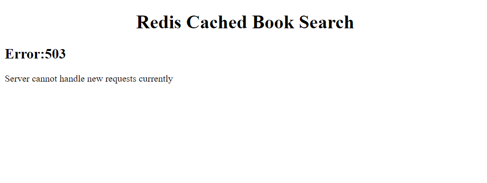

# REDIS APP

This is a simple web app that uses Redis for caching search results for future searches.
The pages are generated using ejs and shows whether the search results were obtained from cache or not.

## Features
  
  -Caching search results
  -Simple Pagination made from scratch
  -Ratelimiting

### Caching

The app uses ioredis package and a free tier instance provided by the official redis site.
**Note: Due to being hosted on free tier, the redis instance may be deleted due to inactivity.**
The queries are made to the openlibrary.org api. And the obtained results are filtered and shown to the user in more suitable format.
The rendered page also displays whether the page was generated using data from cache or by making query to the api.
There is also option to toggle the caching feature to test the speeds between cached and non cached requests.

### Pagination

The app uses a simple pagination in the front end. The pagination component is generated by a script and then injected in the ejs document.
It shows at max 7 pages numbers and if there are more than that then they are truncated.

### Ratelimiting

The app has two types of ratelimiting. It features ratelimiting users based on their ip.
And other it ratelimits itself from making queries to the openlibrary api. 
This is to ensure that the server's ip itself doesn't get banned if multiple users are making frequent requests and will continue working as usual after set amount of time.

